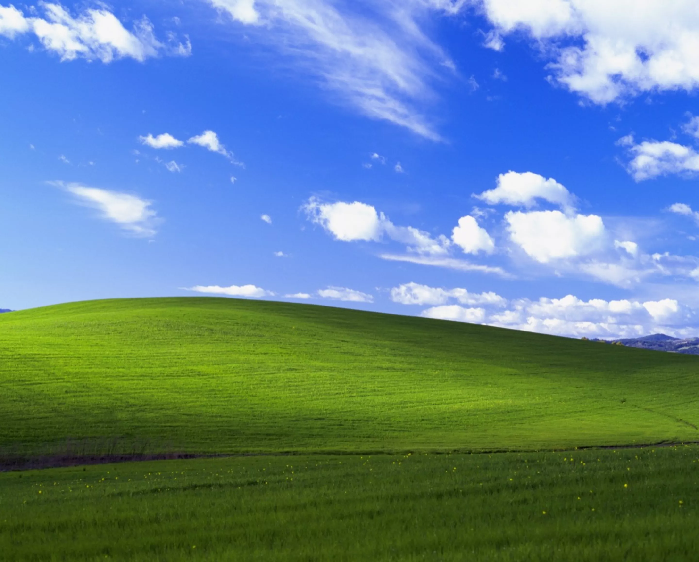
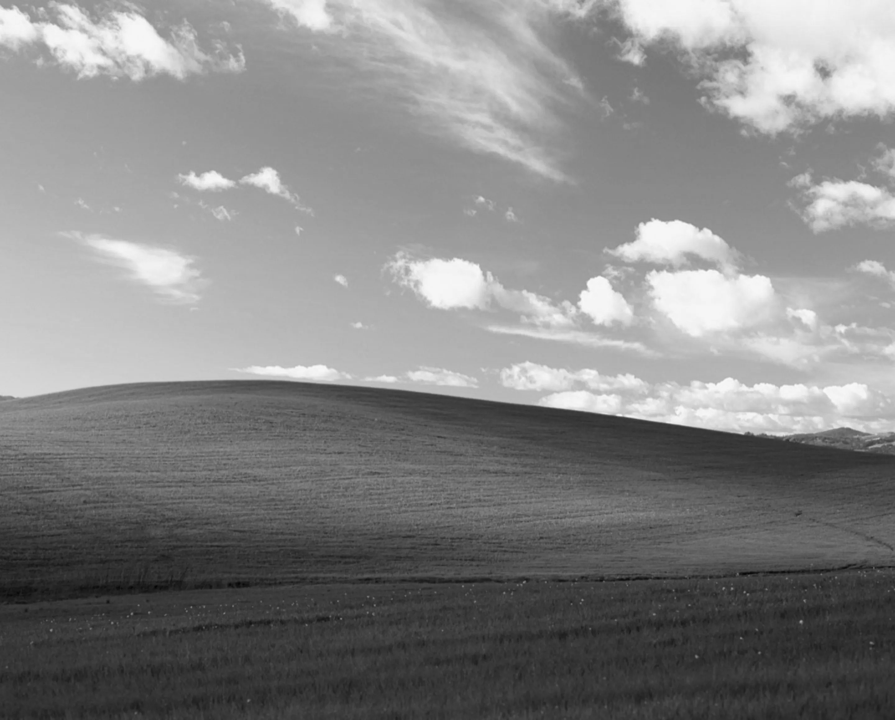
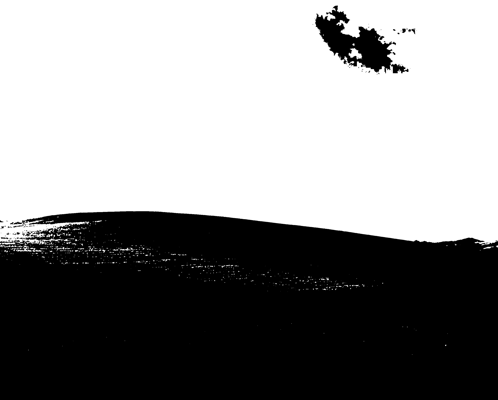
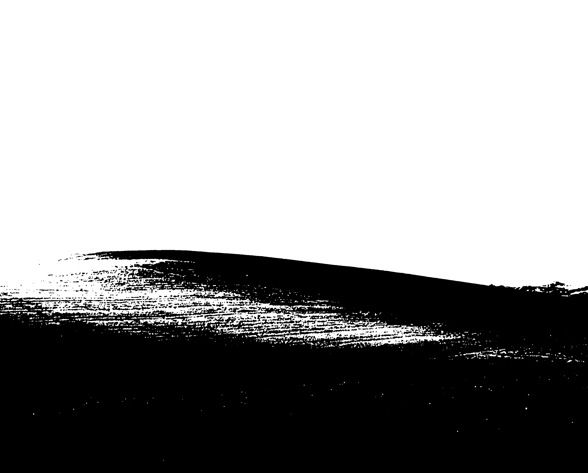
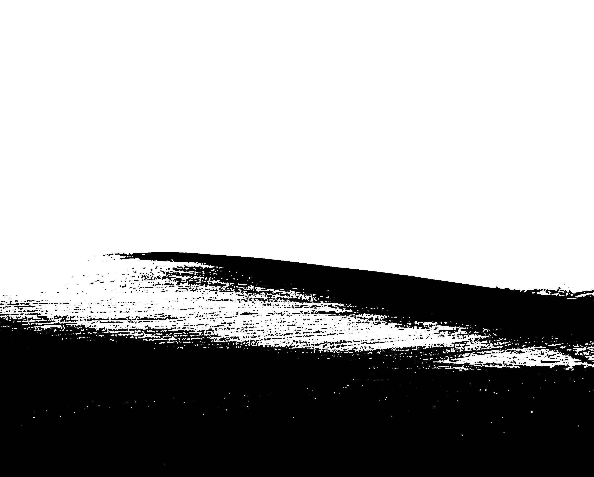
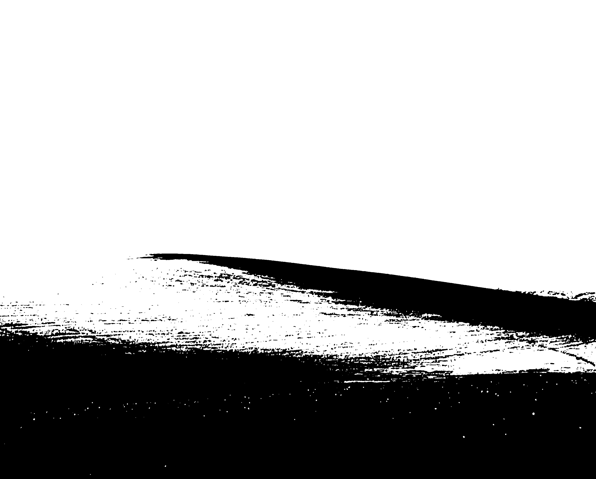

# Tratamento de Cores em Imagens

Este projeto demonstra o processamento de imagens coloridas utilizando Python, OpenCV e manipulação matricial, sem uso de bibliotecas de machine learning. O fluxo está dividido em etapas, cada uma referenciada conforme o notebook.

## Resumo das etapas
- [Importação e Conversão da Imagem](#1-importação-e-conversão-da-imagem)
- [Leitura e Manipulação Matricial](#2-leitura-e-manipulação-matricial)
- [Conversão para Escala de Cinza](#3-conversão-para-escala-de-cinza)
- [Conversão para Preto e Branco](#4-conversão-para-preto-e-branco)

O notebook está organizado em células separadas para cada etapa, facilitando o entendimento, execução e modificação do fluxo completo de processamento de imagens.

## Bibliotecas utilizadas
- OpenCV 4.8.0
- NumPy 1.26.4
- Matplotlib 3.8.4

## 1. Importação e Conversão da Imagem

**Segmento 1:** Leitura da imagem original (`landscape.jpeg`) e conversão para o formato PPM.

```python
img = cv2.imread('landscape.jpeg')
cv2.imwrite('entrada.ppm', img)
```


## 2. Leitura e Manipulação Matricial

**Segmento 2:** Leitura do arquivo PPM e preparação da matriz RGB para processamento.

```python
largura, altura, max_valor, matriz = ler_ppm('entrada.ppm')
```

## 3. Conversão para Escala de Cinza
Conversão da imagem colorida para escala de cinza usando média ponderada dos canais RGB.

```python
matriz_cinza = escala_de_cinza(matriz)
salvar_ppm('saida_cinza.ppm', largura, altura, max_valor, matriz_cinza)
img_cinza = cv2.imread('saida_cinza.ppm')
cv2.imwrite('saida_cinza.jpg', img_cinza)
```


## Sobre a transformação para escala de cinza

A conversão de uma imagem colorida para escala de cinza é feita utilizando uma média ponderada dos valores dos canais de cor RGB (vermelho, verde e azul) de cada pixel. A fórmula utilizada é:

```
cinza = 0.299 * R + 0.587 * G + 0.114 * B
```

- **R**: valor do canal vermelho
- **G**: valor do canal verde
- **B**: valor do canal azul

Esses coeficientes refletem a sensibilidade do olho humano a cada cor, dando mais peso ao verde, seguido do vermelho e, por último, ao azul. O resultado é um valor único de intensidade para cada pixel, que é replicado nos três canais para formar o pixel em tons de cinza.

No código, cada pixel é processado dessa forma:
```python
def escala_de_cinza(matriz):
    matriz_cinza = []
    for pixel in matriz:
        r, g, b = pixel
        cinza = int(0.299 * r + 0.587 * g + 0.114 * b)
        matriz_cinza.append([cinza, cinza, cinza])
    return matriz_cinza
```

## 4. Conversão para Preto e Branco

Transformação da imagem em preto e branco utilizando limiar padrão (128) e limiares alternativos (110, 100, 90).

```python
matriz_pb = preto_e_branco(matriz)
salvar_ppm('saida_pb.ppm', largura, altura, max_valor, matriz_pb)
img_pb = cv2.imread('saida_pb.ppm')
cv2.imwrite('saida_pb.jpg', img_pb)
```


**Limiar alternativo:**
```python
matriz_pb110 = preto_e_branco(matriz, 110)
salvar_ppm('saida_pb110.ppm', largura, altura, max_valor, matriz_pb110)
img_pb110 = cv2.imread('saida_pb110.ppm')
cv2.imwrite('saida_pb110.jpg', img_pb110)
```
| Limiar 110 | Limiar 100 | Limiar 90 |
|:---:|:---:|:---:|
|  |  |  |

## Conclusão

Este projeto demonstrou técnicas básicas de processamento de imagens utilizando Python e OpenCV, abordando desde a leitura de imagens até a aplicação de diferentes transformações de cor. As etapas foram organizadas de forma a facilitar a compreensão e a modificação do código, permitindo que usuários possam experimentar com diferentes abordagens e parâmetros.
